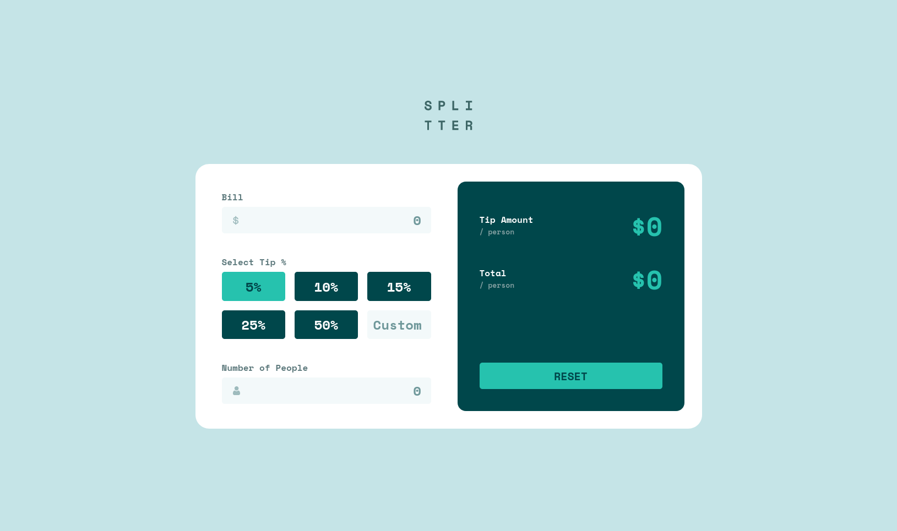

# Bitoid - Tip calculator app solution

This is a solution to the Tip calculator app challenge on Bitoid.
## Table of contents

- [Overview](#overview)
  - [The challenge](#the-challenge)
  - [Screenshots](#screenshot)
  - [Links](#links)
  - [Built with](#built-with)
- [Author](#author)

**Note: Delete this note and update the table of contents based on what sections you keep.**

## Overview

### The challenge

Users should be able to:

- View the optimal layout for the app depending on their device's screen size
- See hover states for all interactive elements on the page
- Calculate the correct tip and total cost of the bill per person

### Screenshots

### Links

- Solution URL: [Add solution URL here](https://github.com/acdavit/tip-calculator-app)
- Live Site URL: [Add live site URL here](https://tip-calculator-app-acdavit.netlify.app)

## My process

### Built with

- Semantic HTML5 markup
- CSS custom properties
- Flexbox
- CSS Grid
- Mobile-first workflow
- [React](https://reactjs.org/) - JS library

## Author

- LinkedIn - [David Abakelia-Chartia](https://www.linkedin.com/in/%E1%83%93%E1%83%90%E1%83%95%E1%83%98%E1%83%97-%E1%83%90%E1%83%91%E1%83%90%E1%83%99%E1%83%94%E1%83%9A%E1%83%98%E1%83%90-%E1%83%A9%E1%83%90%E1%83%A0%E1%83%A2%E1%83%98%E1%83%90-16a85524a/)
- GitHub - [@acdavit](https://github.com/acdavit)

